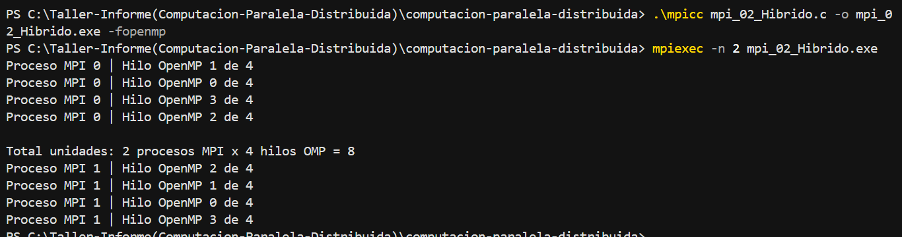
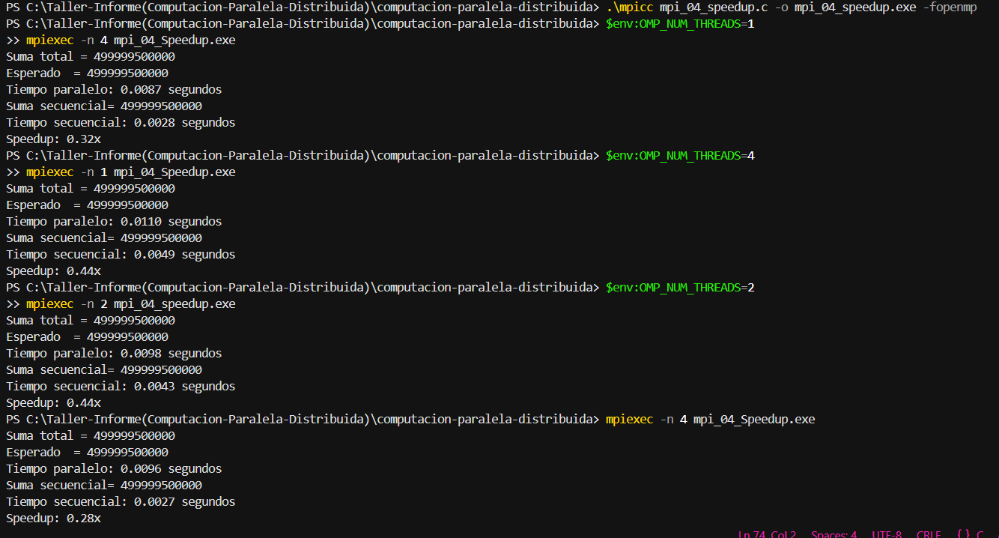

# Laboratorio 1: Programación Paralela e Híbrida con MPI y OpenMP

Repositorio correspondiente al desarrollo de ejercicios de **Computación Paralela y Distribuida**, utilizando programación híbrida con **MPI** y **OpenMP** en lenguaje C.

---

## Integrantes
- Valentina Cerpa
- Raul

---

# Ejercicio 2: Programación Híbrida MPI + OpenMP

## Código fuente
`mpi_02_Hibrido.c`

## Compilación
```bash
.\mpicc mpi_02_Hibrido.c -o mpi_02_Hibrido.exe -fopenmp
```

## Ejecución
```bash
mpiexec -n 4 mpi_02_Hibrido.exe
```

## Evidencia


---

# Ejercicio 4: Medición de Speedup

## Código fuente
`mpi_04_Speedup.c`

## Compilación
```bash
.\mpicc mpi_04_Speedup.c -o mpi_04_speedup.exe -fopenmp
```

## Ejecución
```bash
mpiexec -n 4 mpi_04_speedup.exe
```

## Evidencia


---

## Tecnologías utilizadas
- C
- Microsoft MPI
- OpenMP
- MinGW-w64
- Visual Studio Code
- GitHub