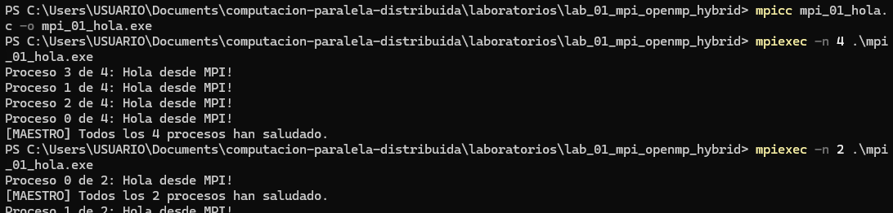
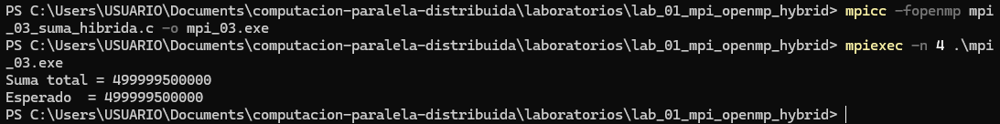

# LAB-01-MPI-OPENMP-HYBRID | Valentina Cerpa & Raul Delgado

> **Asignatura:** Fundamentos de Programación Concurrente y Distribuida  
> **Docente:** Prf. Alejandro Jaimes  
> **Fecha:** 11/05/2026  
> **Repositorio:** [LINK_REPO](https://github.com/Raul-2112/computacion-paralela-distribuida)

---

## Equipo

| | Colaborador | GitHub |
|---|---|---|
| 👤 | Valentina Cerpa | [@Valen187](https://github.com/Valen187) |
| 👤 | Raul Delgado | [@Raul-2112](https://github.com/Raul-2112) |

**Repositorio:** [computacion-paralela-distribuida](https://github.com/Raul-2112/computacion-paralela-distribuida)  
**Rama principal:** `main`

---

# Ejercicio 1: Hola Mundo MPI

## Código fuente
`mpi_01_hola.c`

## Compilación
```bash
mpicc mpi_01_hola.c -o mpi_01_hola.exe
```

## Ejecución
```bash
mpiexec -n 4 .\mpi_01_hola.exe
mpiexec -n 2 .\mpi_01_hola.exe
```

## Evidencia

---

## Respuestas a preguntas de análisis
### 1. ¿Por qué el orden de salida varía entre ejecuciones  
Porque los procesos MPI se ejecutan de forma completamente independiente y en paralelo real. Cuando cada proceso llega a su instrucción `printf`, el sistema operativo decide qué proceso obtiene acceso a la salida estándar en cada momento según la planificación del CPU. No existe ningún mecanismo implícito de orden entre procesos MPI, por eso la secuencia cambia en cada ejecución. Esto no es un error: es la naturaleza del paralelismo de memoria distribuida.
---

### 2. ¿Qué pasaría si ejecutas con `-n 1?  
El programa funcionaría correctamente pero no habría paralelismo real. Existiría un solo proceso (rank 0, size 1), así que imprimiría "Proceso 0 de 1: ¡Hola desde MPI!" y luego el mensaje del maestro. No tendría sentido usar MPI para un único proceso, ya que se pierde toda la ventaja de la distribución de trabajo y se añade el overhead de inicialización de MPI sin ningún beneficio.
---
### 3. ¿Para qué sirve `MPI_COMM_WORLD`?  
`MPI_COMM_WORLD` es el comunicador por defecto que agrupa a **todos** los procesos lanzados con `mpiexec`. Un comunicador define el contexto de comunicación: qué procesos pueden enviarse mensajes entre sí y bajo qué numeración. Sí podrían existir otros comunicadores: con `MPI_Comm_split` o `MPI_Comm_create` se pueden crear subcomunicadores que agrupen solo un subconjunto de procesos, lo cual es útil para estructurar algoritmos complejos donde distintos grupos de procesos realizan tareas diferentes.

---

# Ejercicio 2: Programación Híbrida MPI + OpenMP

## Código fuente
`mpi_02_Hibrido.c`

## Compilación
```bash
mpicc mpi_02_Hibrido.c -o mpi_02_Hibrido.exe -fopenmp
```

## Ejecución
```bash
mpiexec -n 4 mpi_02_Hibrido.exe
```

## Evidencia


---

## Respuestas a preguntas de análisis

### 1. Con 2 procesos MPI y 4 hilos OMP, ¿cuántas unidades de cómputo hay?

El numero de unidades de computo se saben mediante el calculo del numero de procesos mutiplicando por la cantidad de hilos que se crearon por procesos, en este caso.

Total = 2 × 4 = 8

Por lo tanto, existen **8 unidades de cómputo activas**, ejecutando tareas de una manera simultánea.

---

### 2. ¿Diferencia entre `-n 4` (4 MPI, 4 hilos) vs `-n 1` (1 MPI, 16 hilos)?

Ambos casos generan **16 unidades de cómputo**, pero trabajan de una forma diferente:
Por ejemplo:

- **`-n 4` (4 MPI × 4 hilos):**
  - Se crean 4 procesos independientes.
  - Cada proceso genera 4 hilos.
  - Existe mayor comunicación entre procesos.

- **`-n 1` (1 MPI × 16 hilos):**
  - Solo existe un proceso.
  - Se crean 16 hilos dentro del mismo proceso.
  - Hay menor overhead(recursos adicionales del equipo) de comunicación.

 Entoces se tiene que la diferencia principal está en cómo se distribuye el trabajo y en el costo de comunicación de los procesos.

---
### 3. ¿Por qué `MPI_Init_thread` en lugar de `MPI_Init`?

Se utiliza `MPI_Init_thread()` porque el programa combina  ambos conceptos de **MPI y OpenMP**, es decir, procesos e hilos simultáneamente.

Siendo esto de ayuda para que así  los múltiples hilos que existen eviten tener conflictos en la ejecucion y uso de programación híbrida.

En este caso, este ejercicio del laboratorio se utilizó `MPI_THREAD_FUNNELED`, que permite que solo el hilo principal invoque funciones MPI, aun asi teniendo la misma caracteristica para no causar problemas entre los hilos y el programa.

---

# Ejercicio 3: Suma hibrida de vector 

## Código fuente
`mpi_03_suma_hibrida.c`

## Compilación
```bash
mpicc -fopenmp mpi_03_suma_hibrida.c -o mpi_03.exe
```

## Ejecución
```bash
mpiexec -n 4 .\mpi_03.exe
```

## Evidencia


---
## Respuestas a preguntas de análisis

### 1. ¿Qué hace exactamente `MPI_Scatter`?
`MPI_Scatter` toma un arreglo que existe en el proceso raíz (rank 0) y lo divide en bloques iguales de `count` elementos, enviando uno a cada proceso del comunicador, incluyendo al propio proceso 0. Es una operación colectiva: **todos** los procesos deben llamarla (incluido el maestro) porque es una comunicación de uno-a-todos. El proceso raíz envía, y cada proceso (incluido él mismo) recibe su bloque en el buffer `local`. Esto evita tener que hacer múltiples `MPI_Send`/`MPI_Recv` manuales.
---

### 2. ¿Por qué `reduction(+:suma_local)` y no una variable compartida?
Si varios hilos OpenMP escribieran simultáneamente en una misma variable compartida (`suma_local += local[i]`), ocurrirían condiciones de carrera: dos hilos podrían leer el mismo valor, sumarle su elemento y escribir de vuelta, perdiéndose una de las sumas. La cláusula `reduction(+:suma_local)` resuelve esto creando una copia privada de `suma_local` por cada hilo; cada hilo acumula en su copia sin conflictos, y al final de la región paralela OpenMP combina todas las copias con una suma. Es más eficiente que usar una sección crítica porque elimina la serialización.
---

 ### 3.¿Qué pasaría si olvidaras `MPI_Reduce` e imprimieras `suma_local` en rank 0? 
El proceso 0 solo imprimiría su propia suma parcial (la correspondiente a los primeros 250,000 elementos si hay 4 procesos), ignorando las sumas de los otros tres procesos. El resultado sería aproximadamente 1/4 del valor correcto. Además, los procesos 1, 2 y 3 habrían terminado su trabajo sin que nadie recogiera sus resultados, lo que constituye un error lógico grave aunque no necesariamente cause un crash.


---

# Ejercicio 4: Medición de Speedup

## Código fuente
`mpi_04_Speedup.c`

## Compilación
```bash
.\mpicc mpi_04_Speedup.c -o mpi_04_speedup.exe -fopenmp
```

## Ejecución
```bash
mpiexec -n 4 mpi_04_speedup.exe
```

## Evidencia


---

## Respuestas a preguntas de análisis

### 1. ¿Coincide con la Ley de Amdahl?

Sí. Ya que la Ley de Amdahl dice que la aceleración de un programa depende o está limitada por esa pequeña parte secuencial, lo que significa qué, aunque aumentemos el número de procesos e hilos, siempre existirá una parte del programa que no puede paralelizarse completamente, lo que limita un speedup total.

---

### 2. ¿Por qué más procesos/hilos no siempre dan mayor speedup?

Porque al agregar más procesos o hilos eso significa que tambien se tendria costos adicionales, como:

- sincronización,
- comunicación entre procesos MPI,
- acceso compartido a memoria;
- entre otros casos que existan.

Por eso, el programa puede que llege a un punto donde, el agregar más procesos/hilos no mejora el rendimiento e incluso puede disminuirlo, lo que puede que sea perdida de igual manera.

---

### 3. ¿Qué overhead introduce MPI que no existe en OpenMP puro?

MPI introduce **sobrecarga de comunicación**, debido al intercambio de datos entre procesos mediante funciones como:

- `MPI_Send`
- `MPI_Recv`
- `MPI_Scatter`
- `MPI_Reduce`

En OpenMP no existe costos en cuanto a la comunicación, por lo que los hilos comparten memoria, logrando ser asi mas rapido.

---

# Conclusiones

1. Cuando se trabaja con programacion parelalela nos permite ver que, se puede reducir el tiempo de ejecucion del programa dividiendo su trabajo en multiples partes de procesamiento.
2. Por otra parte se tiene el tema de MPI, en el cual se trabajan los procesos de manera inndependiente junto al parelelismo que brinda OPENMP que son los hilos que se ejecutan dentro de un mismo proceso, teniendo con esto un trabajo hibrido aprovechando el rendimiento del hardware, pero tambien aun así teniendo todos estos procesos que si mejora el programa, no siempre existira un rendimiento 100/100, ya que esta esa parte secuencial del mismo que lo limita o el overhead que se deba generar.

