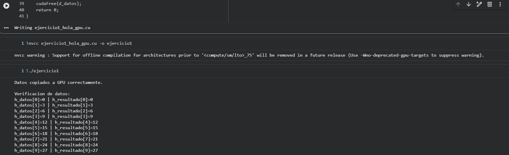

# Ejercicio 1 — Hola GPU: Mi primer programa CUDA

## Descripción
Primer contacto con el modelo de programación CUDA. Se transfiere un arreglo de enteros entre CPU y GPU y se verifica que los datos lleguen intactos.

## Archivo
- `ejercicio1_hola_gpu.cu`

## Conceptos aplicados
- `cudaMalloc` — reservar memoria en la GPU
- `cudaMemcpy` con `cudaMemcpyHostToDevice` y `cudaMemcpyDeviceToHost`
- `cudaFree` — liberar memoria de la GPU
- Verificación elemento a elemento en CPU

## Compilar y ejecutar

```bash
nvcc ejercicio1_hola_gpu.cu -o ejercicio1
./ejercicio1
```

## Salida esperada

```
Datos copiados a GPU correctamente.
Verificacion de datos:
  h_datos[0]=0,  h_resultado[0]=0
  h_datos[1]=3,  h_resultado[1]=3
  ...
  h_datos[9]=27, h_resultado[9]=27

[OK] Transferencia exitosa!
```

## Evidencia

## Evidencia


