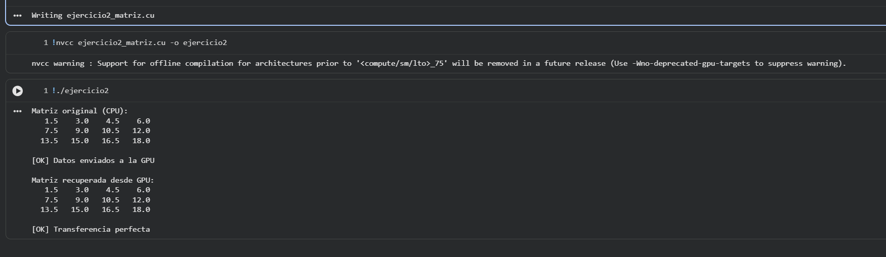

# Ejercicio 2 — Copia de Matriz 2D CPU ↔ GPU

## Descripción
Transferencia de una matriz 2D representada como arreglo 1D (row-major). Se añade verificación automática de integridad usando tolerancia de punto flotante.

## Archivo
- `ejercicio2_matriz.cu`

## Conceptos aplicados
- Representación plana de matrices 2D: `m[i][j] → m[i * COLS + j]`
- `cudaMemcpy` para tipos `float`
- Verificación con `fabsf(a - b) < 1e-5f` (comparación segura de flotantes)

## TAREA resuelta
Verificación automática elemento a elemento que detecta cualquier diferencia entre la matriz original y la recuperada desde la GPU.

## Compilar y ejecutar

```bash
nvcc ejercicio2_matriz.cu -o ejercicio2
./ejercicio2
```

## Salida esperada

```
Matriz original (CPU):
   1.5    3.0    4.5    6.0
   7.5    9.0   10.5   12.0
  13.5   15.0   16.5   18.0

[OK] Datos enviados a la GPU

Matriz recuperada desde GPU:
   1.5    3.0    4.5    6.0
   ...

Verificacion automatica (tolerancia 1e-5):
  Todos los 12 elementos coinciden. [OK]
```

## Evidencia

## Evidencia


