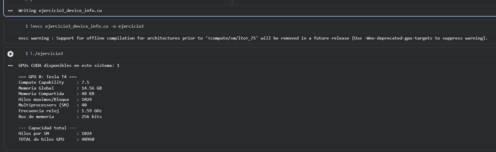

# Ejercicio 3 — Información del Device

## Descripción
Consulta y muestra las propiedades de todas las GPUs CUDA disponibles en el sistema. Incluye el cálculo del total de hilos simultáneos que puede alojar la GPU.

## Archivo
- `ejercicio3_device_info.cu`

## Conceptos aplicados
- `cudaGetDeviceCount` — número de GPUs disponibles
- `cudaGetDeviceProperties` — estructura `cudaDeviceProp` con todas las propiedades
- Propiedades consultadas: nombre, compute capability, memoria global, shared memory, hilos/bloque, SMs, frecuencia, ancho de bus, dimensiones máximas

## TAREA resuelta
Cálculo del total de hilos simultáneos máximos con la fórmula:

```
Total hilos = multiProcessorCount × maxThreadsPerMultiProcessor
```

Este valor representa cuántos hilos pueden estar **residentes** en la GPU al mismo tiempo (ocupación máxima teórica).

## Compilar y ejecutar

```bash
nvcc ejercicio3_device_info.cu -o ejercicio3
./ejercicio3
```

## Salida esperada (varía según GPU)

```
GPUs CUDA disponibles en este sistema: 1

=== GPU 0: GeForce GTX 1060 ===
  Compute Capability     : 6.1
  Memoria Global         : 6.00 GB
  Memoria Compartida/Blq : 48 KB
  Hilos maximos/Bloque   : 1024
  Multiprocessors (SM)   : 10
  Hilos maximos/SM       : 2048
  ...

  >>> Hilos simultaneos maximos (SM x hilos/SM): 20480
      (10 SM  x  2048 hilos/SM)
```

## Evidencia

## Evidencia


