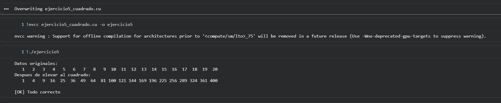

# Ejercicio 5 — Cuadrado de Elementos In-place

## Descripción
Kernel que modifica un arreglo directamente sobre sí mismo en la GPU (in-place): cada elemento es reemplazado por su cuadrado. Se verifica que el resultado sea `(i+1)²` para cada posición.

## Archivo
- `ejercicio5_cuadrado.cu`

## Conceptos aplicados
- Escritura in-place: el kernel lee y escribe el **mismo** puntero `d_datos`
- Ausencia de dependencias entre hilos (cada hilo trabaja solo sobre su `idx`)
- Verificación con el valor esperado `(i+1)*(i+1)`

## TAREA resuelta
Bucle de verificación que compara cada elemento recuperado con su valor esperado e imprime los índices con error si los hay.

## Compilar y ejecutar

```bash
nvcc ejercicio5_cuadrado.cu -o ejercicio5
./ejercicio5
```

## Salida esperada

```
Datos originales:
   1   2   3   4   5   6   7   8   9  10  11  12  13  14  15  16  17  18  19  20
Despues de elevar al cuadrado en GPU:
   1   4   9  16  25  36  49  64  81 100 121 144 169 196 225 256 289 324 361 400

Verificacion (esperado: 1, 4, 9, 16, ... 400):
  Todos los 20 elementos son correctos. [OK]
```

## Evidencia

## Evidencia


