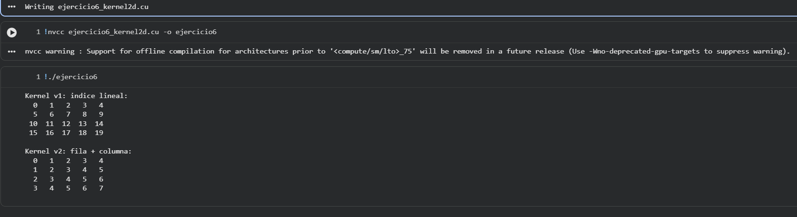

# Ejercicio 6 — Kernel 2D: Inicialización de Matriz

## Descripción
Uso de indexación bidimensional en CUDA con `dim3`. Se implementan dos kernels: uno que almacena el índice lineal de cada celda y otro (TAREA) que almacena la suma `fila + columna`.

## Archivo
- `ejercicio6_kernel2d.cu`

## Conceptos aplicados
- Tipo `dim3` para definir bloques e hilos en 2D
- Índice de fila y columna por hilo:
  ```c
  int col  = blockIdx.x * blockDim.x + threadIdx.x;
  int fila = blockIdx.y * blockDim.y + threadIdx.y;
  ```
- Conversión a índice lineal: `idx = fila * COLS + col`
- Guard de límites en 2D: `if (fila < FILAS && col < COLS)`

## TAREA resuelta
Kernel `inicializarMatrizSuma` donde cada celda almacena `fila + col` en lugar del índice lineal.

## Compilar y ejecutar

```bash
nvcc ejercicio6_kernel2d.cu -o ejercicio6
./ejercicio6
```

## Salida esperada

```
Kernel 1 - mat[i][j] = indice lineal:
  0   1   2   3   4
  5   6   7   8   9
 10  11  12  13  14
 15  16  17  18  19

Kernel 2 (TAREA) - mat[i][j] = i + j:
  0   1   2   3   4
  1   2   3   4   5
  2   3   4   5   6
  3   4   5   6   7
```

## Evidencia

## Evidencia


