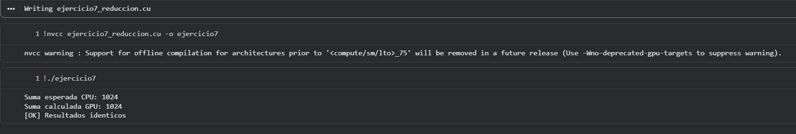

# Ejercicio 7 — Reducción Paralela con Shared Memory

## Descripción
Suma de un arreglo de 1024 enteros mediante reducción en árbol, usando `shared memory` para minimizar accesos a memoria global. Demuestra el uso correcto de `__syncthreads()` para sincronizar hilos dentro de un bloque.

## Archivo
- `ejercicio7_reduccion.cu`

## Conceptos aplicados
- `extern __shared__ int s_datos[]` — shared memory dinámica por bloque
- Reducción en árbol: en cada paso, la mitad de los hilos activos acumula con su par a distancia `stride`
- `__syncthreads()` — barrera de sincronización intra-bloque
- Suma de resultados parciales por bloque en la CPU

## Por qué `__syncthreads()` es indispensable

Sin la barrera, los hilos del siguiente nivel del árbol leerían `s_datos[tid + stride]` **antes** de que el hilo vecino terminara de escribirlo, causando una condición de carrera (*race condition*) con resultado no determinista.

## Tercer parámetro del lanzamiento

```c
reduccionSuma<<<numBloques, THREADS, THREADS * sizeof(int)>>>(...)
//                                   ^^^^^^^^^^^^^^^^^^^^^^^^^^^
//                           Bytes de shared memory por bloque
```

## Compilar y ejecutar

```bash
nvcc ejercicio7_reduccion.cu -o ejercicio7
./ejercicio7
```

## Salida esperada

```
Suma esperada  (CPU): 1024
Bloques lanzados: 4  |  Hilos por bloque: 256
Suma calculada (GPU): 1024
[OK] Resultados identicos!
```

## Evidencia

## Evidencia


