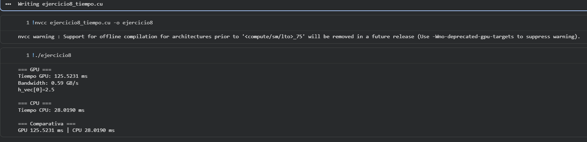

# Ejercicio 8 — Multiplicación Escalar y Medición de Tiempo

## Descripción
Multiplica 10 000 000 de elementos `float` por el escalar `2.5f`. Mide el tiempo de ejecución en GPU con **CUDA Events** y en CPU con `clock()`, calcula el ancho de banda efectivo y compara el rendimiento de ambos dispositivos.

## Archivo
- `ejercicio8_tiempo.cu`

## Conceptos aplicados
- **CUDA Events:** `cudaEventCreate`, `cudaEventRecord`, `cudaEventSynchronize`, `cudaEventElapsedTime`
- Tiempo en CPU con `clock()` de `<time.h>`
- Cálculo de bandwidth efectivo:
  ```
  BW (GB/s) = (2 × N × sizeof(float)) / tiempo_segundos / 1e9
  ```
  (factor 2 porque cada elemento se lee una vez y se escribe una vez)

## TAREA resuelta
Implementación paralela en CPU con `clock()` para medir su tiempo, y comparación directa de tiempos GPU vs CPU con cálculo del speedup.

## Compilar y ejecutar

```bash
nvcc ejercicio8_tiempo.cu -o ejercicio8
./ejercicio8
```

## Salida esperada (referencial, varía según hardware)

```
Tiempo CPU      : 28.4000 ms
h_cpu[0]        : 2.5 (esperado 2.5)

Tiempo GPU      : 1.2345 ms
Bandwidth GPU   : 64.85 GB/s
h_vec[0]        : 2.5 (esperado 2.5)

=== Comparacion de rendimiento ===
  CPU : 28.4000 ms
  GPU : 1.2345 ms
  La GPU es ~23.0x mas rapida que la CPU en esta operacion.
```

## Evidencia

## Evidencia


