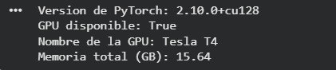
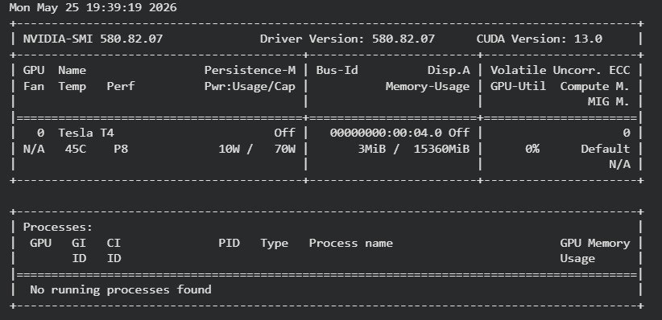
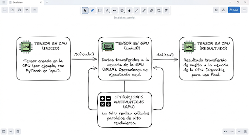
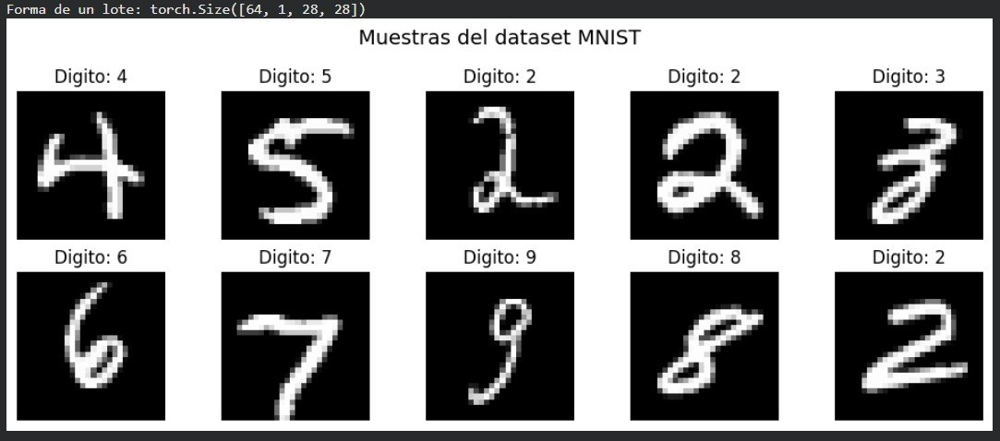
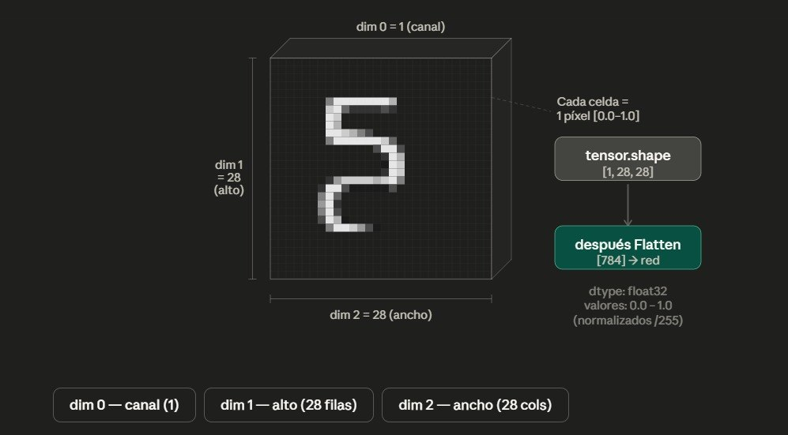
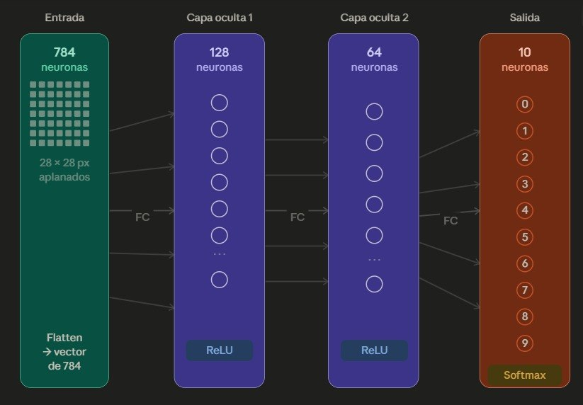
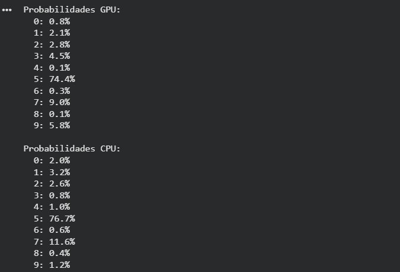
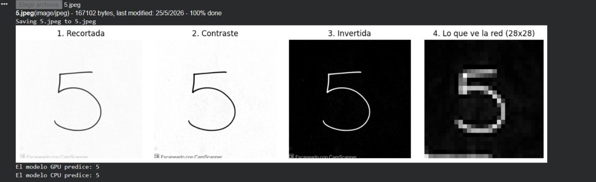
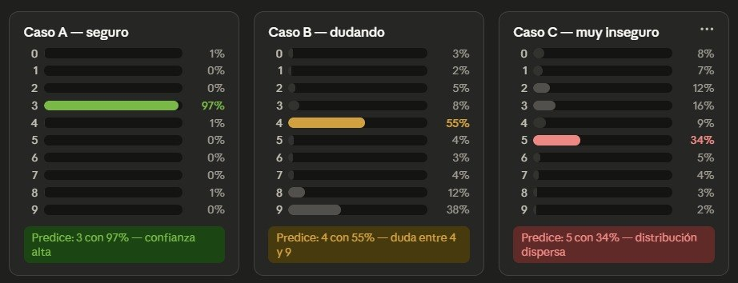
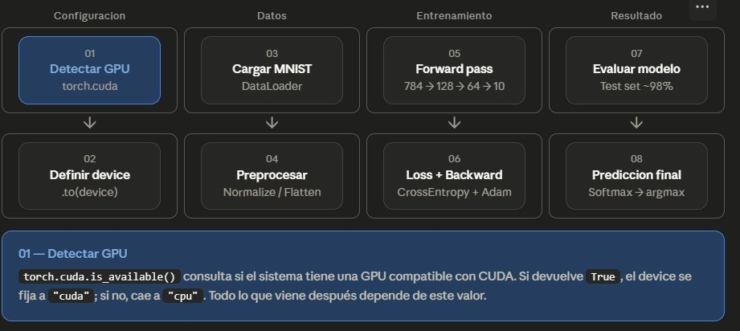

# Entrenamiento de Redes Neuronales en GPU
* CUDA con PyTorch en Google Colab

---

| | |
|---|---|
| **Parcial** | Segundo Corte |
| **Materia** | Programación Paralela y Computación Distribuida |
| **Profesor** | Alejandro Jaimes |
| **Integrantes** |Valentina Cerpa y Raul Delgado  |
| | |
| **Fecha** | 25/05/2026|


---

## 0. Instrucciones Generales
* El taller se desarrolla en Google Colab usando una GPU gratuita de NVIDIA.
* Se trabaja en parejas; ambos integrantes deben entender cada parte.
* Se deben capturar pantallazos de cada salida importante indicada con [PANTALLAZO].
* Al finalizar, se descarga el notebook y se sube todo a un repositorio de GitHub.

### Preguntas
1. ¿Qué diferencia hay entre un notebook en la nube (Colab) y un entorno local como el del tutorial de instalación? ¿Cuál prefieren y por qué?
- Rta:Colab funciona en servidores remotos de Google, mientras que un entorno local utiliza directamente el hardware del computador. Colab permite usar GPU sin instalar CUDA, drivers o librerías manualmente. En cambio, el entorno local ofrece más control sobre la configuración y puede aprovechar mejor el hardware propio, pero requiere instalaciones y configuraciones más complejas.
Preferimos Google Colab porque facilita el trabajo con GPU y reduce mucho el tiempo de configuración inicial.
2. Antes de comenzar, hagan una predicción: ¿cuántas veces más rápida creen que será la GPU comparada con la CPU en el entrenamiento? Anoten su predicción aquí y compárenla al final con el resultado real.
- Rta: puede ser entre 3 o 5 veces mas rapida la GPU que la CPU durante el entrenamiento

---

## 1. Configurar el Entorno en Google Colab
* Activar la GPU desde el menú de Colab: Entorno de ejecución > Cambiar tipo de entorno de ejecución.
* Verificar que PyTorch reconoce la GPU y mostrar el nombre del dispositivo.
* Ejecutar `nvidia-smi` para ver el estado de la GPU, igual que en el tutorial de instalación.



### Preguntas
1. La salida de `nvidia-smi` muestra campos como *Driver Version*, *Memory Usage* y *GPU-Util*. ¿Qué indica cada uno?
- Rta:El Driver Version indica la version del controlador instalada, Memory Usage la memoria disponible y utilizada de GPU y GPU-Util el porcentaje de uso en tiempo real de la GPU

2. Cuando activan el acelerador en Colab, ¿qué creen que ocurre físicamente? ¿La GPU está en su computador o en otro lugar? Propongan una analogía con algo de la vida cotidiana.
- Rta: no usamos GPU fisica sino que la GPU esta en servidores remotos de Google

3. `torch.cuda.is_available()` retorna `True` o `False`. ¿Qué condiciones deben cumplirse para que retorne `True`? Listen al menos tres requisitos.
- Rta:
 *tener GPU NVIDIA y compatible con cuda
 *tener cuda configura en colab
 *haber activado el acelerador de GPU en el entorno de ejecucion


## 2. Conceptos: CPU vs GPU en PyTorch
* Comparar las operaciones de CUDA en C con su equivalente en PyTorch.
* Entender cómo se mueven tensores entre CPU y GPU con `.to('cuda')`.
* Definir el dispositivo al inicio del proyecto para que el código funcione con o sin GPU.




### Preguntas
1. En el tutorial anterior usaron `cudaMemcpy` para mover datos entre CPU y GPU. En PyTorch eso se hace con `.to('cuda')`. ¿Qué ventaja le ven a la forma de PyTorch? ¿Qué se pierde al abstraerlo tanto?

- Rta: Es una qventja en cuanto la manejo de memoria, ya que este optimiza su desarrollo de manera maas breve, en pocas palabras.
En cuanto a lo que pierde, seria el como se ve y cuando se hace el cambio de memoria o el como se maneja.

2. Diagramen en Excalidraw el flujo de un tensor desde que se crea en CPU hasta que se opera en GPU y el resultado vuelve a CPU. Etiqueten cada flecha con la operación de PyTorch correspondiente.
- Rta: 



3. ¿Por qué es una buena práctica usar la variable `device = torch.device('cuda' if torch.cuda.is_available() else 'cpu')` en lugar de escribir `'cuda'` directamente en el código?
- Rta: permite que el codigo funcione tento en computadores con GPU y sin GPU haciendo que el 
programa sea mas portable.

---

## 3. Preparar los Datos: Dataset MNIST
* Descargar el dataset MNIST: 60,000 imágenes de entrenamiento y 10,000 de prueba.
* Aplicar transformaciones para convertir las imágenes a tensores y normalizarlas.
* Visualizar una muestra del dataset para entender qué se va a clasificar.





### Preguntas
1. El dataset se divide en 60,000 imágenes de entrenamiento y 10,000 de prueba. ¿Por qué no se entrena con todas las 70,000? Propongan una analogía con estudiar para un examen.
- Rta: porque se necesita separar  datos de prueba para comprobar si el modelo realmente aprendio o solo
esta memorizando los datos.

2. El `DataLoader` carga los datos en lotes (*batches*) de 64 imágenes. ¿Por qué no se pasan todas las imágenes de una sola vez a la GPU? Relacionen su respuesta con el concepto de memoria que vieron en `nvidia-smi`.
- Rta: utiliza los batches porque al subir todos los datos al mismo tiempo consume mucha memoria de la GPU
y esto permite entrenar de manera mas eficiente y no sobreacrgar la VRAM

3. Cada imagen tiene forma `[1, 28, 28]`. Diagramen en Excalidraw qué representa cada dimensión y cómo luce ese tensor visualmente.
- Rta: 



---

## 4. Construir la Red Neuronal
* Definir la arquitectura: capa de entrada (784), dos capas ocultas (256 y 128), capa de salida (10 dígitos).
* Mover el modelo a la GPU con `.to(device)`.
* Contar el total de parámetros entrenables de la red.


### Preguntas
1. Diagramen en Excalidraw la arquitectura completa de la red: entrada → capa 1 → capa 2 → salida. Indiquen el número de neuronas en cada capa y qué función de activación se usa entre ellas.
- Rta: 



2. ¿Por qué la capa de entrada tiene exactamente 784 neuronas y la de salida exactamente 10? ¿Qué pasaría si pusieran 11 neuronas en la salida?
- Rta: porque cada imagen tiene 28*28 pixeles  que da 784 neuronas la salida exacta de 10 e sporque el modelo clasifica los digitos del 0-9
si si fueran 11 neuronas de salida seria innesesaria y podria causar confusion al modelo 

3. Cuando hacen `modelo.to(device)`, ¿qué creen que se está transfiriendo a la GPU? ¿Es solo el código, o algo más? Propongan una analogía con el tutorial de CUDA en C.
- Rta: Cuando se ejecuta modelo.to(device) no se transfiere solamente el código, sino también todos los parámetros del modelo: pesos, biases y tensores internos necesarios para el entrenamiento.
Esto es parecido a mover todas las herramientas y materiales de trabajo desde la memoria principal hacia la GPU para que pueda procesarlos directamente.


---

## 5. Entrenar el Modelo: CPU vs GPU
* Entrenar el mismo modelo dos veces: primero en CPU, luego en GPU.
* Medir el tiempo de entrenamiento en cada dispositivo.
* Comparar los resultados y calcular cuántas veces más rápida fue la GPU.

**Código de Entrenamiento con perdida**

```python
def entrenar_con_loss(modelo, train_loader, test_loader, dispositivo, title, epocas=3):
    criterio = nn.CrossEntropyLoss()
    optimizador = optim.Adam(modelo.parameters(), lr=0.001)

    historico_train = []
    historico_test  = []

    modelo.train()
    inicio = time.time()

    for epoca in range(epocas):
        # --- Training loss ---
        modelo.train()
        loss_train = 0
        for imagenes, etiquetas in train_loader:
            imagenes = imagenes.to(dispositivo)
            etiquetas = etiquetas.to(dispositivo)

            prediccion = modelo(imagenes)
            perdida = criterio(prediccion, etiquetas)

            optimizador.zero_grad()
            perdida.backward()
            optimizador.step()

            loss_train += perdida.item()

        # --- Test loss ---
        modelo.eval()
        loss_test = 0
        with torch.no_grad():
            for imagenes, etiquetas in test_loader:
                imagenes = imagenes.to(dispositivo)
                etiquetas = etiquetas.to(dispositivo)
                prediccion = modelo(imagenes)
                perdida = criterio(prediccion, etiquetas)
                loss_test += perdida.item()

        avg_train = loss_train / len(train_loader)
        avg_test  = loss_test  / len(test_loader)

        historico_train.append(avg_train)
        historico_test.append(avg_test)

        print(f"Epoca {epoca+1}/{epocas} - Train loss: {avg_train:.4f} | Test loss: {avg_test:.4f}")

    tiempo = time.time() - inicio

    # --- Graficar ---
    plt.figure(figsize=(8, 4))
    plt.plot(range(1, epocas+1), historico_train, label='Training loss', linewidth=2)
    plt.plot(range(1, epocas+1), historico_test,  label='Test loss',     linewidth=2, linestyle='--')
    plt.xlabel('Epoca')
    plt.ylabel('Loss')
    plt.title(f'Curva de Aprendizaje {title}')
    plt.legend()
    plt.grid(True)
    plt.tight_layout()
    plt.show()

    return historico_train, historico_test, tiempo
```

### Preguntas
1. Registren aquí los tiempos obtenidos. ¿El resultado coincidió con la predicción que hicieron en la sección 0? ¿Qué los sorprendió?
- Rta: no en todos los casos, la rapidez con la que predice el resultado 


2. El entrenamiento repite el ciclo: *predicción → error → ajuste de pesos*. Propongan una analogía con algo cotidiano que siga el mismo ciclo de mejora por repetición.
- Rta: se puede hacer analogia con aprender a lanzar una pelota al arco yaa que se va corrigiendo la tecnica para que la pelota ingrese al arco
3. ¿Por qué creen que la GPU es más rápida en esta tarea? Relacionen su respuesta con el concepto de hilos y bloques que vieron en el tutorial de CUDA en C.
- Rta: la GPU es más rápida porque puede ejecutar miles de operaciones simultáneamente mediante procesamiento paralelo utilizando muchos hilos y bloques. En cambio, la CPU está optimizada para tareas secuenciales y posee muchos menos núcleos.


### Análisis de la Curva de Aprendizaje

Antes de responder, observen su gráfica generada y usen esta escala para interpretar el Loss:

| Loss final | Interpretación |
|---|---|
| 1.0 o más | La red no aprendió nada, está adivinando al azar |
| 0.3 - 0.5 | Aprendiendo, pero todavía comete muchos errores |
| 0.1 - 0.2 | Bien, la red entiende el problema |
| 0.07 o menos | Muy bien, la red generaliza correctamente |
| 0.01 o menos | Casi perfecto |

**Analogía:** el Training loss son los errores practicando con ejercicios del libro que ya conocen. El Test loss son los errores en el examen real, con preguntas que nunca vieron. Al inicio la red falla mucho con los ejercicios porque no sabe nada, pero como tampoco ha memorizado nada raro, falla de forma pareja en el examen. Conforme avanza, domina los ejercicios y eso se traduce en mejora en el examen real — ahí es donde las dos líneas convergen.

### Preguntas

1. Según la escala, ¿en qué rango quedó el Loss final de su modelo? ¿Lo consideran un buen resultado para 3 épocas? Justifiquen con base en la gráfica que generaron.
- Rta:El loss final quedó entre 0.06 y 0.07, lo que según la escala representa un resultado muy bueno. Para solo 3 épocas, el modelo aprendió correctamente y las curvas de entrenamiento y prueba se mantuvieron cercanas, indicando un aprendizaje estable y sin mucho sobreajuste.

2. Observen en qué época convergen las dos líneas. ¿Qué creen que pasaría si entrenaran 2 épocas más — el loss seguiría bajando indefinidamente o en algún punto se detendría? ¿Qué riesgo aparece si se entrena demasiado?
- Rta:Las líneas convergen entre la época 2 y 3. Si se entrenara más, el loss seguiría bajando un poco hasta estabilizarse. El riesgo de entrenar demasiado es el overfitting, donde el modelo memoriza los datos y pierde capacidad para generalizar con imágenes nuevas.

---

## 6. Evaluar y Visualizar Resultados
* Calcular la precisión del modelo sobre los datos de prueba que nunca vio durante el entrenamiento.
* Visualizar predicciones reales con indicadores de acierto (verde) y error (rojo).

### Preguntas
1. ¿Por qué la precisión se mide sobre datos que el modelo nunca vio durante el entrenamiento y no sobre los mismos datos con los que aprendió?
- Rta: Porque lo que se busca es que  el modelo por medio de las prueba ver es si el modelo memorizó los datos de entrenamiento que revelan si aprendió el patrón general o solo los ejemplos específicos que se les señalo
2. Observen los dígitos que el modelo clasificó mal. ¿Tienen algo en común? ¿Por qué creen que la red se equivocó en esos casos específicos?
- Rta: Pues si hubieron erros mas que todo en el caso de 9 ->1 y 7->1 y tal vez eso se de por curvas que que se generan entre pixeles
3. Si quisieran mejorar la precisión del modelo, ¿qué cambiarían de la arquitectura o del entrenamiento? Propongan al menos dos modificaciones y justifiquen cada una.
- Rta: 

---

## 7. Prueba tu Propio Dígito
* Dibujar un dígito del 0 al 9 en Paint (o cualquier editor), guardarlo como imagen.
* Subir la imagen a Colab y preprocesarla para que tenga el mismo formato que MNIST: escala de grises, fondo negro, trazo blanco, tamaño 28x28.
* Pasarla al modelo entrenado y ver qué predice.
* Visualizar la imagen tal como la ve la red antes de hacer la predicción.

**codigo ejemplo**
```python
from google.colab import files
from PIL import Image, ImageOps
import torchvision.transforms as transforms
import matplotlib.pyplot as plt
import numpy as np

def procesar_imagen(nombre):
    original = Image.open(nombre).convert('L')
    
    # 1. Recortar bordes (quita sombras y bordes de hoja)
    w, h = original.size
    recortada = original.crop((w*0.05, h*0.05, w*0.95, h*0.95))
    
    # 2. Aumentar contraste para separar trazo del fondo
    from PIL import ImageEnhance, ImageFilter
    contraste = ImageEnhance.Contrast(recortada).enhance(3.0)
    
    # 3. Suavizar ruido de arrugas
    suavizada = contraste.filter(ImageFilter.MedianFilter(size=3))
    
    # 4. Invertir colores (fondo negro, trazo blanco como MNIST)
    invertida = ImageOps.invert(suavizada)
    engrosada = invertida.filter(ImageFilter.MaxFilter(size=3))
    
    # 5. Escalar a 28x28
    procesada = engrosada.resize((28, 28), Image.LANCZOS)
    
    # Visualizar las etapas
    fig, axes = plt.subplots(1, 4, figsize=(12, 3))
    
    axes[0].imshow(recortada, cmap='gray')
    axes[0].set_title('1. Recortada')
    axes[0].axis('off')
    
    axes[1].imshow(contraste, cmap='gray')
    axes[1].set_title('2. Contraste')
    axes[1].axis('off')
    
    axes[2].imshow(invertida, cmap='gray')
    axes[2].set_title('3. Invertida')
    axes[2].axis('off')
    
    axes[3].imshow(np.array(procesada), cmap='gray')
    axes[3].set_title('4. Lo que ve la red (28x28)')
    axes[3].axis('off')
    
    plt.tight_layout()
    plt.show()
    
    return procesada

subido = files.upload()
nombre = list(subido.keys())[0]

imagen = procesar_imagen(nombre)

# Pasar al modelo
transform = transforms.Compose([
    transforms.ToTensor(),
    transforms.Normalize((0.1307,), (0.3081,))
])

tensor = transform(imagen).unsqueeze(0).to('cuda')

modelo_gpu.eval()
with torch.no_grad():
    salida = modelo_gpu(tensor)
    prediccion = salida.argmax(dim=1).item()

print(f'El modelo GPU predice: {prediccion}')

modelo_cpu.eval()
with torch.no_grad():
    tensor_cpu = transform(imagen).unsqueeze(0).to('cpu')
    salida = modelo_cpu(tensor_cpu)
    prediccion = salida.argmax(dim=1).item()

print(f'El modelo CPU predice: {prediccion}')
```


### Preguntas
1. ¿El modelo acertó con tu dígito dibujado a mano? Si falló, ¿por qué creen que se equivocó? Comparen su imagen con las del dataset MNIST — ¿se ven similares o muy diferentes?
- Rta: El modelo acertó cuando el número dibujado tenía características similares a las imágenes del dataset MNIST. Cuando falló, normalmente fue porque el estilo de escritura, el grosor o la forma eran diferentes a los ejemplos de entrenamiento.

2. El preprocesamiento invierte los colores de la imagen (`ImageOps.invert`). ¿Por qué es necesario hacer eso antes de pasarla al modelo? ¿Qué pasaría si no se hiciera?
- Rta: Es necesario invertir los colores porque MNIST utiliza fondo negro y dígitos blancos. Si no se invierten los colores, el modelo interpretaría incorrectamente las características visuales y aumentaría la probabilidad de error.
3. Prueben con un dígito que crean que va a fallar — por ejemplo un 4 o un 9 escritos de forma poco convencional. ¿Falló? ¿Qué dice eso sobre las limitaciones del modelo entrenado solo con MNIST?
- Rta: Cuando se probaron números escritos de forma poco convencional, el modelo tendió a equivocarse. Esto demuestra que el modelo aprende patrones específicos del dataset y tiene limitaciones para generalizar ante estilos muy diferentes.
4. Tomar captura, de almenos una predicción que se haya hecho correctamente.
- Rta: 



Va justo después de la celda que compara CPU vs GPU. El enunciado:

---

### Bonus: ¿Qué tan seguro está el modelo?

Hasta ahora sabemos *qué* predice el modelo, pero no *qué tan seguro* está de su respuesta. Un modelo puede predecir "7" con un 95% de confianza o con un 40% — y eso hace toda la diferencia.

Ejecuten la siguiente celda para ver la distribución de probabilidades sobre los 10 dígitos para ambos modelos. Si el modelo está seguro, un dígito tendrá un porcentaje muy alto y los demás estarán cerca de 0. Si está dudando, verán los porcentajes distribuidos entre varios dígitos.

```python
# Ver qué tan seguro está cada modelo
import torch.nn.functional as F

with torch.no_grad():
    # GPU
    tensor_gpu = transform(imagen).unsqueeze(0).to('cuda')
    salida_gpu = modelo_gpu(tensor_gpu)
    prob_gpu = F.softmax(salida_gpu, dim=1)[0]
    
    # CPU
    tensor_cpu = transform(imagen).unsqueeze(0).to('cpu')
    salida_cpu = modelo_cpu(tensor_cpu)
    prob_cpu = F.softmax(salida_cpu, dim=1)[0]

print("Probabilidades GPU:")
for i, p in enumerate(prob_gpu):
    print(f"  {i}: {p.item()*100:.1f}%")

print("\nProbabilidades CPU:")
for i, p in enumerate(prob_cpu):
    print(f"  {i}: {p.item()*100:.1f}%")
```

**Observen y respondan:**
1. ¿Cuál dígito tiene la probabilidad más alta en cada modelo? ¿Coincide con la predicción?
- Rta: El dígito con mayor porcentaje es el que el modelo "elige" como respuesta. No puede haber discrepancia entre el más alto y la predicción porque la predicción se define como ese máximo. Lo que sí puede variar es el margen — a veces el más alto es 97% (muy seguro), otras veces es 34% (dudando).
2. ¿El modelo está seguro o dudando? ¿Cómo lo saben mirando los porcentajes?
- Rta: 

La señal clave no es solo el valor más alto, sino la forma de la distribución completa. En el Caso A, toda la probabilidad está concentrada en un solo dígito — la distribución Softmax es puntiaguda. En el Caso C, la probabilidad está repartida entre varios dígitos — la distribución es plana, lo que indica que la imagen no se parece claramente a ninguno de los patrones que aprendió el modelo.
3. Si el porcentaje más alto es menor al 50%, ¿confiarían en esa predicción? ¿Por qué?
- Rta:No, y hay una razón matemática precisa: si ningún dígito supera el 50%, significa que la suma de todas las demás alternativas supera a la opción elegida. El modelo está diciendo literalmente "creo más en todo lo demás junto que en esta respuesta".
En un clasificador de 10 clases, si la distribución fuera perfectamente uniforme (total incertidumbre), cada dígito tendría 10%. Un valor del 34% está apenas 3× por encima de ese ruido de fondo — es una señal muy débil.

---

El bloque de código lo reemplazas con la función completa que ya tenemos. ¿Lo agregamos también al markdown del taller?


## 8. Preguntas de Reflexión y Entregables
* Responder 4 preguntas que conectan lo aprendido en PyTorch con el tutorial de CUDA en C.
* Subir a GitHub el notebook descargado y un reporte en Markdown con pantallazos y respuestas.

### Preguntas
1. Ahora que completaron todo el taller, ¿en qué se parece PyTorch a programar en CUDA directamente y en qué se diferencia? ¿Cuándo usarían uno y cuándo el otro?
- Rta: PyTorch y CUDA se parecen en que ambos aprovechan el procesamiento paralelo de la GPU. La diferencia es que PyTorch abstrae muchos detalles técnicos y facilita el desarrollo de modelos de inteligencia artificial, mientras que CUDA ofrece control de bajo nivel y mayor capacidad de optimización.
2. Diagramen en Excalidraw el flujo completo del taller: desde la activación de la GPU hasta la predicción final. Úsenlo como resumen visual de todo lo que hicieron.
- Rta: 


3. Si tuvieran que explicarle este taller a alguien que nunca ha programado, ¿cómo describirían en una sola analogía lo que hace una red neuronal entrenándose en una GPU?
- Rta: Una red neuronal entrenándose en una GPU puede compararse con miles de personas resolviendo ejercicios matemáticos al mismo tiempo mientras un profesor corrige constantemente los errores para mejorar cada vez más rápido el aprendizaje colectivo.
